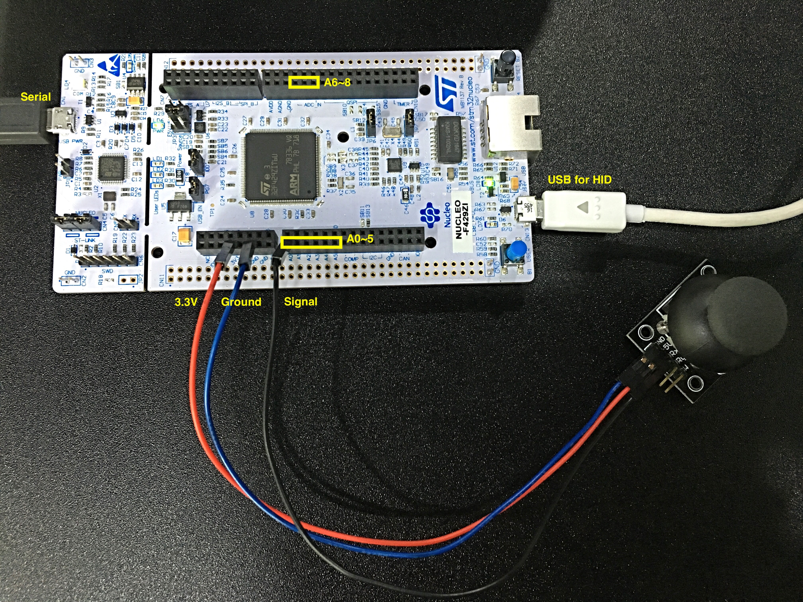

# Basic Functions Test

This is an example project for [ST-Nucleo-F429ZI](http://www.coxlab.kr/doxygen/Nol.A-SDK/group__STNucleoF429ZI.html) board to test basic GPIO, interrupt, SerialPort, Timer, USB HID class, and ADC functions.

