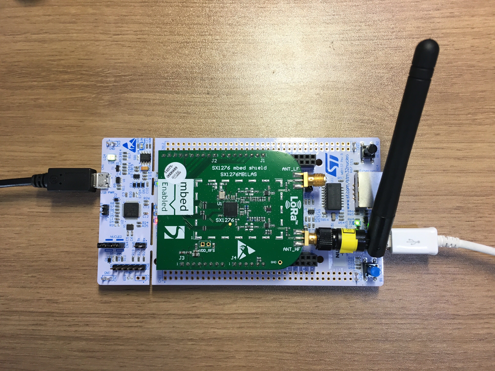

# Basic Functions Test

This is an example project for [ST-Nucleo-F429ZI](http://www.coxlab.kr/doxygen/Nol.A-SDK/group__STNucleoF429ZI.html) and [SX1276MB1xAS](https://os.mbed.com/components/SX1276MB1xAS/) to test LoRaWAN.

The user USB is just to test that USB-HID co-works with LoRa RF.
